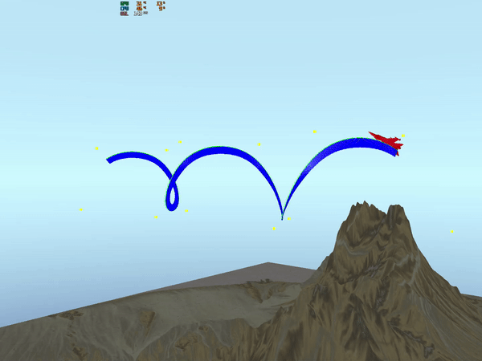
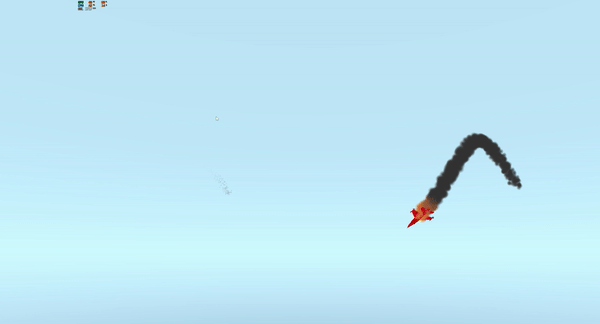

# RGLabs

Laboratory exercises for Computer graphics course.

### Lab 1 
#### F16 model following BSpline curve defined by control points
 

### Lab 2 
#### Particle system
 

### Lab 3 
#### Used my own vulkan engine to implement water rendering using dudv map
 
